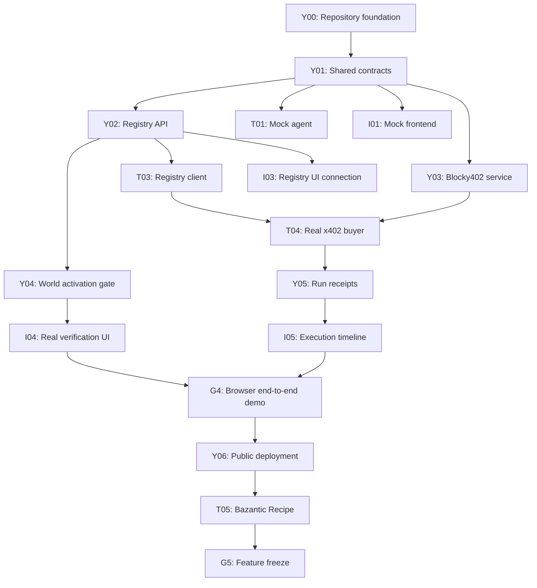

# ProofServe — Team Build Playbook

**Hackathon:** ETHOnline 2026  
**Team:** Yhlas, Tugrahan, Ilham  
**Working period:** September 5–13, 2026  
**Official submission:** September 13 at 18:00 (Warsaw time, as displayed on the event dashboard)  
**Internal submission deadline:** September 13 at 12:00 Warsaw time  
**Primary prize target:** Hedera — AI & Agentic Payments  
**Secondary targets:** World — Selfie Check; Bazantic — Best Recipe using ETHGlobal sponsor APIs

---

## 0. How Codex Must Use This File

This playbook is project context, not permission to implement every task in it.

When this file is attached to a Codex prompt:

1. Codex must read the complete playbook before editing.
2. Codex must implement only the task ID explicitly named in the current prompt.
3. Later tasks are context only and must not be started early.
4. The current task prompt controls if it is more restrictive than this playbook.
5. `AGENTS.md` and `docs/api-contract.md` control repository-wide and shared-contract rules after those files exist.
6. If instructions conflict or a dependency is not merged, Codex must stop and ask instead of guessing.
7. The initial implementation pass must stop before commit, push, or pull-request creation so a human can review the diff.

Do not copy this entire document into `AGENTS.md`. Keep `AGENTS.md` short and store this playbook under `docs/` after Y00.

---

## 1. Product Definition

### One-sentence pitch

ProofServe is a registry where autonomous agents discover and pay for AI services operated by recently verified, live humans.

### What the final demo must prove

1. A provider creates a draft AI service.
2. The unverified provider tries to activate it and is blocked.
3. The provider completes World Selfie Check.
4. The backend verifies the proof and marks the provider as recently human-verified.
5. The provider activates the service.
6. A buyer agent receives a task, capability requirement, and maximum budget.
7. The agent discovers only active, eligible services.
8. The selected service returns HTTP `402 Payment Required`.
9. The agent checks the price, pays through Blocky402 on Hedera testnet, and retries.
10. The service returns the AI result.
11. The interface shows the verification status, agent decision, payment state, result, and HashScan transaction link.

### Correct product language

Use these claims:

- “Recently verified human operator.”
- “Human-liveness and continuity signal.”
- “The service cannot activate without valid operator verification.”
- “The buyer agent pays per request without a subscription or API key.”

Do not claim:

- “World proves this provider is trustworthy.”
- “Selfie Check proves global uniqueness.”
- “Fake bots can never enter.”
- “The platform guarantees service quality.”

### The only AI service in the MVP

Build one text-based **Support Ticket Triage API**.

Input example:

```json
{
  "ticket": "My payment was taken twice and nobody answered me."
}
```

Output example:

```json
{
  "category": "billing",
  "urgency": "high",
  "summary": "Possible duplicate payment",
  "suggestedAction": "Review payment records and contact the customer"
}
```

### Features forbidden before the core demo works

- More than one real AI service
- Reviews and ratings
- Subscriptions
- Custom tokens
- Mainnet
- Smart contracts
- Admin dashboard
- Mobile application
- Multi-agent negotiation
- Image upload, OCR, or photo translation
- Complex database or authentication system

These are not part of the planned hackathon scope. Codex must not implement them merely because this playbook is attached. Reconsider them only after submission, unless all required gates are already complete and the team lead explicitly approves a small addition.

---

## 2. Team Ownership

| Person | Role | Primary ownership | Folders |
|---|---|---|---|
| **Yhlas** | Team lead and integration engineer | Architecture, shared contracts, registry API, World verification, Hedera, Blocky402, deployment, final integration | `packages/shared/`, `apps/api/`, `apps/service/`, `.github/`, root configuration |
| **Tugrahan** | Buyer-agent and Bazantic engineer | Agent state machine, service discovery, budget decisions, x402 payer client, Bazantic Gateway and Recipe | `apps/agent/`, `recipes/`, `docs/bazantic-*` |
| **Ilham** | Frontend and demo engineer | Provider onboarding, marketplace, agent-run timeline, payment receipt interface, responsive design, demo assets | `apps/web/`, `docs/wireframes/`, `docs/demo-*`, `docs/world-feedback.md` |

### Ownership rules

1. Only Yhlas changes root configuration and `packages/shared/`.
2. Tugrahan must not create a private copy of shared API types inside `apps/agent/`.
3. Ilham must not create a private copy of shared API types inside `apps/web/`.
4. Payment signing and private keys never enter the browser application.
5. World proof verification happens on the server, not by trusting a frontend boolean.
6. When a task requires another owner’s file to change, open an issue for that owner instead of editing it silently.
7. One person may have only one task in progress at a time.
8. Raw World credential/proof payloads, selfies, wallet private keys, and access tokens must not be persisted or logged.
9. The buyer-agent payer runs server-side; the web application displays its status but never receives its signing key.

---

## 3. Repository Structure

```text
ProofServe/
├── apps/
│   ├── web/                  # Ilham
│   ├── api/                  # Yhlas
│   ├── service/              # Yhlas
│   └── agent/                # Tugrahan
├── packages/
│   └── shared/               # Yhlas
├── recipes/                  # Tugrahan
├── docs/
│   ├── architecture.md
│   ├── api-contract.md
│   ├── world-feedback.md
│   ├── bazantic-evidence.md
│   ├── demo-script.md
│   ├── research/
│   │   └── bazantic-notes.md
│   └── wireframes/
├── .github/
│   ├── workflows/ci.yml
│   ├── pull_request_template.md
│   └── CODEOWNERS            # Add only after real GitHub handles are confirmed
├── AGENTS.md
├── ATTRIBUTIONS.md
├── CONTRIBUTING.md
├── .env.example
├── tsconfig.base.json
├── package.json
├── package-lock.json
└── README.md
```

Use TypeScript across all four applications and npm workspaces at the repository root.

### Payment value representation

Never represent HBAR or token values with JavaScript floating-point numbers.

Shared payment and budget fields must use:

- `network`: CAIP-2 string such as `hedera:testnet`
- `asset`: Hedera entity ID such as `0.0.0` for HBAR
- `amountAtomic`: base-unit integer encoded as a decimal string
- `maxAmountAtomic`: base-unit integer encoded as a decimal string

For HBAR, the base unit is tinybar and `1 HBAR = 100000000 tinybars`. Compare amounts with `bigint`, never `number`.

### Service endpoint safety

The MVP supports only the team-controlled, allowlisted ticket-triage service endpoint. The registry and buyer agent must not fetch arbitrary user-provided URLs. Supporting third-party endpoints later requires explicit SSRF protections, URL validation, and network allowlisting.

---

## 4. Dependency Map



### Dependency rule

If a required task is not merged into `main`, the dependent task does not start.

While blocked, the owner may:

- Read official documentation.
- Prepare wireframes.
- Write test cases in plain language.
- Prepare sample input and expected output.
- Review another teammate’s PR.

The owner may not invent an alternative API or duplicate missing types.

---

## 5. Milestone Gates

| Gate | Deadline | Required result |
|---|---|---|
| **G0 — Repository ready** | Sep 5, 12:00 | All members can clone, install, run validation, create branches, and open PRs |
| **G1 — Shared contracts frozen** | Sep 5, 15:00 | Shared schemas and API examples are merged; frontend and agent may begin |
| **G2 — Hedera proof** | Sep 6, 22:00 | Unpaid request returns 402; real paid request settles through Blocky402 and returns a result |
| **G3 — Verification registry** | Sep 7, 22:00 | Unverified activation fails; valid World flow permits activation |
| **G4 — Full browser demo** | Sep 9, 22:00 | One browser completes verification → discovery → payment → result → receipt |
| **G5 — Feature freeze** | Sep 10, 18:00 | Core demo and Bazantic flow work; no new features allowed |
| **G6 — Submission package** | Sep 12, 22:00 | Video, README, evidence, public URLs, and partner requirements are complete |

If a gate fails, all three members stop new feature work and help repair the failed gate.

If a listed clock time has already passed, do not skip the gate or begin dependent work. Complete the gates in dependency order and record the actual completion time.

---

## 6. Daily Schedule

### September 5 — Foundation and shared contracts

#### Yhlas

##### Y00 — Repository foundation

**Branch:** `chore/y00-project-foundation`  
**PR title:** `chore(repo): initialize ProofServe workspace`

Tasks:

- Create a minimally runnable npm workspace structure. Empty directories do not count because Git cannot track them.
- Add the smallest package files and source entry points needed for every workspace to be tracked, typechecked, tested, and built; do not add business features.
- Configure TypeScript strict mode.
- Add formatting, lint, test, typecheck, and build commands.
- Add and commit `package-lock.json`; CI must use `npm ci`.
- Add CI that runs `npm run validate`.
- Add `.gitignore` and `.env.example`.
- Add `AGENTS.md`, `CONTRIBUTING.md`, `ATTRIBUTIONS.md`, and PR template.
- Add this playbook as `docs/ProofServe-Team-Build-Playbook.md`.
- Add `CODEOWNERS` only after Tugrahan’s and Ilham’s exact GitHub handles are provided. Codex must not invent handles.

Manual GitHub tasks for Yhlas, not Codex implementation tasks:

- Invite Tugrahan and Ilham as collaborators.
- Configure branch protection to require pull requests and one approval before merging to `main`.
- Disable force pushes and branch deletion for `main`.

Immediate external-access tasks for Yhlas, also not Codex implementation tasks:

- Request access for World Selfie Check immediately because the feature is access-gated.
- Create separate Hedera testnet accounts for the buyer-agent payer and service receiver.
- Store all account keys outside Git and never attach or paste them into Codex prompts.

Done when:

- Everyone successfully clones the repository.
- `npm install` succeeds.
- `npm ci` succeeds from a clean checkout.
- `npm run validate` succeeds.
- A test PR can be opened.

##### Y01 — Shared domain and API contracts

**Depends on:** Y00  
**Branch:** `feat/y01-shared-contracts`  
**PR title:** `feat(shared): define registry and agent contracts`

Create shared Zod schemas and TypeScript types for:

- `Provider`
- `VerificationRecord`
- `ServiceListing`
- `AgentTask`
- `AgentRun`
- `PaymentReceipt`
- Shared API error format

Also create and export shared fixtures for the explicitly mocked T01 and I01 tasks. Keep fixtures in `packages/shared/` so the agent and frontend cannot invent separate shapes.

Payment-related schemas must use decimal-string atomic amounts (`amountAtomic` and `maxAmountAtomic`), Hedera CAIP-2 network names, and Hedera asset entity IDs. Verification records must include `verifiedAt` and `expiresAt`. ProofServe’s provider-verification freshness window is a project policy configured server-side; it is separate from World’s own credential inactivity behavior and must not be hardcoded in the browser.

Required status values:

```text
Verification: UNVERIFIED | VERIFIED | EXPIRED
Service: DRAFT | ACTIVE | SUSPENDED
Run: CREATED | DISCOVERING | SELECTED | PAYMENT_REQUIRED | PAYING |
     PAID | EXECUTING | COMPLETED | FAILED
```

Create `docs/api-contract.md` with JSON request and response examples.

Done when:

- Shared tests validate good and bad objects.
- Both Tugrahan and Ilham understand the contract.
- Y01 is merged before T01 or I01 begins.

#### Tugrahan

##### T00 — Bazantic and agent research

No code until Y01 is merged.

Tasks:

- Create a Bazantic account.
- Read Gateway and Recipe requirements.
- Study the x402 client request → 402 → payment → retry flow.
- Write five agent selection test scenarios.
- Save questions in `docs/research/bazantic-notes.md` on a docs branch.

#### Ilham

##### I00 — Demo wireframes

No application code until Y01 is merged.

Create wireframes for:

1. Landing page
2. Provider registration
3. Verification and blocked activation
4. Service marketplace
5. Agent execution and payment receipt

**Branch:** `docs/i00-demo-wireframes`  
**PR title:** `docs(web): add ProofServe demo wireframes`

---

### September 6 — Hedera payment proof

#### Yhlas

##### Y03 — Protected AI service

**Depends on:** Y01  
**Branch:** `feat/y03-x402-service`  
**PR title:** `feat(service): gate ticket triage with Hedera x402`

Tasks:

- Implement `POST /v1/triage`.
- Validate request size and structure.
- Protect it with the official x402 v2 Hedera packages (`@x402/core` and `@x402/hedera`).
- Configure network `hedera:testnet`.
- Use HBAR asset entity ID `0.0.0` and decimal-string tinybar amounts.
- Configure the Blocky402 facilitator.
- Extract the settlement transaction from the response.
- Add a HashScan URL helper.
- Add an unpaid request test.
- Add a real-payment smoke-test script that is never run in CI without explicitly configured testnet credentials.
- Put inference behind a `TriageEngine` interface. Automated tests use a deterministic fake engine; the deployed judge demo must use a real model-backed implementation selected and configured by Yhlas through server environment variables.

Acceptance criteria:

1. Unpaid request returns HTTP 402.
2. Payment requirements specify Hedera testnet.
3. Payment is facilitated through Blocky402.
4. Paid retry returns HTTP 200 and the AI result.
5. Settlement transaction is visible on HashScan.
6. No private key is committed.
7. The service receiver account does not require a receiver private key at runtime.
8. The deployed judge path returns a real model-generated triage result, not a hardcoded success payload.

#### Tugrahan

##### T01 — Agent state machine

**Depends on:** Y01  
**Branch:** `feat/t01-agent-state-machine`  
**PR title:** `feat(agent): add buyer-agent state machine`

Use shared fixtures only. Implement legal state transitions and tests. Do not call a real service yet.

##### T02 — Budgeted service selection

**Depends on:** T01  
**Branch:** `feat/t02-service-selection`  
**PR title:** `feat(agent): select verified services within budget`

Agent rules:

- Exclude unverified providers.
- Exclude inactive services.
- Exclude services with the wrong capability.
- Exclude services above the maximum budget.
- Rank valid services deterministically.
- Return a typed error when no service qualifies.
- Compare `maxAmountAtomic` and service `amountAtomic` using `bigint`; never parse payment values into JavaScript `number`.

#### Ilham

##### I01 — Frontend shell

**Depends on:** Y01  
**Branch:** `feat/i01-web-shell`  
**PR title:** `feat(web): add ProofServe application shell`

Tasks:

- Add navigation and page layout.
- Add shared design tokens.
- Render service cards from shared fixtures.
- Add mobile and desktop layouts.

##### I02 — Provider onboarding states

**Depends on:** I01  
**Branch:** `feat/i02-provider-onboarding`  
**PR title:** `feat(web): add provider onboarding states`

Use fixtures to show:

- Draft service
- Unverified provider
- Activation blocked
- Verification pending
- Verified provider
- Active service
- Verification error

---

### September 7 — Registry and World verification

#### Yhlas

##### Y02 — Provider and service registry

**Depends on:** Y01  
**Branch:** `feat/y02-service-registry`  
**PR title:** `feat(api): add provider and service registry`

Routes:

```http
GET  /health
POST /api/providers
GET  /api/providers/:providerId
POST /api/services
POST /api/services/:serviceId/activate
GET  /api/services?capability=ticket-triage&network=hedera:testnet&asset=0.0.0&maxAmountAtomic=1000000
```

Use an in-memory repository behind a storage interface.

For the MVP, service registration must select the team-controlled ticket-triage endpoint from server configuration; it must not cause the API or buyer agent to request arbitrary user-supplied URLs.

##### Y04 — World verification activation gate

**Depends on:** Y02  
**Branch:** `feat/y04-world-verification`  
**PR title:** `feat(api): gate service activation with World verification`

Tasks:

- Add `POST /api/providers/:providerId/verification/world`.
- Integrate the official IDKit Selfie Check flow and verify its returned credential server-side.
- Record verification time and status.
- Reject malformed, failed, expired, or replayed proofs.
- Return 403 when an unverified provider activates a service.
- Permit activation after valid verification.
- Never persist or log raw credential/proof payloads or biometric data.
- Re-verification is required before reactivation or any future endpoint/payout-account change.

Never add a development fallback that accepts any nonempty proof.

#### Tugrahan

##### T03 — Registry discovery client

**Depends on:** Y02 merged  
**Branch:** `feat/t03-registry-client`  
**PR title:** `feat(agent): discover services from registry API`

Replace the production fixture adapter with the real registry API. Retain fixtures only for tests.

#### Ilham

##### I03 — Registry-connected onboarding

**Depends on:** Y02 merged  
**Branch:** `feat/i03-registry-onboarding`  
**PR title:** `feat(web): connect onboarding to service registry`

Connect provider creation, draft service creation, service listing, and blocked activation. Do not fake successful World verification.

---

### September 8 — Real buyer-agent payment

Submit Project Check-in #1 before the event deadline.

#### Yhlas

##### Y05 — Agent runs and receipts

**Depends on:** Y02 and Y03  
**Branch:** `feat/y05-run-receipts`  
**PR title:** `feat(api): expose agent runs and payment receipts`

Routes:

```http
POST /api/agent/runs
GET  /api/agent/runs/:runId
```

Run states must come from real backend events, not timers created only for the UI.

#### Tugrahan

##### T04 — Real x402 buyer

**Depends on:** T02, T03, and Y03 merged  
**Branch:** `feat/t04-x402-buyer`  
**PR title:** `feat(agent): pay selected service through Blocky402`

Required flow:

1. Accept task, capability, and maximum budget.
2. Query registry.
3. Choose an eligible service.
4. Make initial request.
5. Detect HTTP 402.
6. Compare the requested atomic amount with the remaining atomic budget using `bigint`.
7. Reject an over-budget payment.
8. Sign and retry through the official x402 Hedera client.
9. Return result and settlement transaction.

#### Ilham

##### I04 — Real World verification interface

**Depends on:** Y04 merged  
**Branch:** `feat/i04-world-verification-ui`  
**PR title:** `feat(web): connect World verification flow`

Display the real backend outcome. A cancelled or failed verification must never show a verified badge.

Attend Project Feedback Session #1 and record sponsor feedback in the relevant docs files.

---

### September 9 — Browser end-to-end integration

#### Yhlas

- Integrate the agent-run API with the agent application.
- Fix CORS and environment configuration.
- Confirm keys exist only in server environments.
- Run five real testnet payments.
- Pair with Tugrahan on failures; Yhlas remains the payment-code owner.

#### Tugrahan

- Connect T04 to Y05 run events.
- Add typed payment failure, budget failure, and timeout handling.
- Ensure the agent never pays an inactive or unverified service.

#### Ilham

##### I05 — Agent execution timeline

**Depends on:** Y05 and T04 merged  
**Branch:** `feat/i05-execution-timeline`  
**PR title:** `feat(web): display agent payment execution timeline`

Display:

- Task and budget
- Discovery
- Verified provider selection
- Price
- HTTP 402
- Payment signing
- Settlement
- AI execution
- Result
- HashScan transaction link

End-of-day Gate G4: complete the entire judge demo from one browser.

---

### September 10 — Deployment, Bazantic, and feature freeze

#### Yhlas

##### Y06 — Public deployment

**Depends on:** G4  
**Branch:** `chore/y06-public-deployment`  
**PR title:** `chore(deploy): configure public ProofServe services`

Deploy the web application, registry API, paid service, and buyer agent. Document every required environment variable without including values.

#### Tugrahan

##### T05 — Bazantic Gateway and Recipe

**Depends on:** Y06 public URLs  
**Branch:** `feat/t05-bazantic-recipe`  
**PR title:** `feat(recipe): add verified paid-service workflow`

Recipe flow:

1. Discover an active, recently verified service from ProofServe.
2. Call the x402-protected service.
3. Feed the Hedera settlement transaction into a second service: preferably a Hedera sponsor API or Mirror Node endpoint that Bazantic can call.
4. Return the AI result together with payment evidence.

Before implementing step 3, confirm in Bazantic that the chosen second endpoint can be used in the Recipe. Bazantic requires at least one other service already available through Bazantic or available from an ETHOnline sponsor, and the final result must depend meaningfully on both services. If the Mirror Node call cannot be used through Bazantic, stop and select another confirmed sponsor service; do not simulate the second step.

Deliverables:

- Bazantic username recorded.
- Gateway configured.
- Recipe saved.
- Inputs and outputs saved in `docs/bazantic-evidence.md`.
- Complete screen recording produced.

#### Ilham

- Connect the frontend to public URLs.
- Add loading, empty, cancelled, failed, and retry states.
- Finish `docs/world-feedback.md` with real observations.
- Test on desktop and mobile.

Attend the September 10 feedback session. Freeze all features at 18:00.

---

### September 11 — Reliability and Check-in #2

Submit Project Check-in #2 before the event deadline.

#### Yhlas

- Complete README architecture, setup, deployment, and payment-flow sections.
- Verify all public endpoints.
- Verify HashScan links.
- Prepare fresh demo data and backup testnet accounts.
- Check that `.env`, private keys, API keys, and proof payloads are absent from Git history.

#### Tugrahan

Add agent tests for:

- No matching capability
- Unverified provider
- Inactive service
- Service over budget
- HTTP 402 malformed response
- Payment rejected
- Paid retry failure
- Service timeout

Finish Bazantic evidence and screen recording.

#### Ilham

- Test the full demo on a clean browser.
- Test phone and desktop sizes.
- Verify all UI badges come from real backend data.
- Create screenshots.
- Write the first version of `docs/demo-script.md`.

Each person performs a clean clone and setup test on a different machine.

---

### September 12 — Demo and submission package

No new features.

#### Yhlas

- Lead final regression testing.
- Create final architecture diagram.
- Prepare Hedera and security judge answers.
- Confirm the transaction is publicly visible.

#### Tugrahan

- Prepare agent decision and Bazantic judge answers.
- Verify Recipe screen recording.
- Rehearse explaining why the agent selected the service and why it paid.

#### Ilham

- Finalize demo script.
- Record and edit a final demo targeting 3 minutes 30 seconds to 3 minutes 45 seconds. The ETHGlobal upload must remain between 2 and 4 minutes; do not target exactly 4:00 because export rounding can make it ineligible.
- Record a backup video.
- Verify text is readable in the recording.

### Video order

1. Problem and difference from HumanPay
2. Unverified activation blocked
3. World Selfie Check
4. Service activation
5. Buyer task and budget
6. Service discovery and selection
7. HTTP 402 and Blocky402 payment
8. AI result and HashScan receipt
9. Bazantic Recipe and architecture

Gate G6 must be complete by 22:00.

---

### September 13 — Submission day

### 09:00–10:00

- Run the full demo twice.
- Verify repository visibility.
- Verify deployment and video URLs.
- Verify Bazantic username and recording.
- Verify World feedback document.

### 10:00–11:00

- Complete ETHGlobal project description.
- Select the Hedera, World, and Bazantic prize tracks.
- Add architecture, setup, sponsor usage, and AI/Codex disclosure.

### 11:00–12:00

- All three members review every submission field.
- Submit before the internal 12:00 deadline.
- Create Git tag `v1.0.0-hackathon` only after confirming the submitted commit.

### After 12:00

Only fix problems that prevent judging. Do not redesign or add features.

---

## 7. Git and GitHub Rules

### GitHub project columns

```text
Backlog → Ready → In Progress → Review → Done
                         ↘ Blocked
```

### Labels

```text
owner:yhlas
owner:tugrahan
owner:ilham
area:shared
area:api
area:web
area:agent
area:hedera
area:world
area:bazantic
priority:p0
priority:p1
status:blocked
```

### Branch format

```text
<type>/<task-id>-<short-description>
```

Examples:

```text
feat/y03-x402-service
feat/t04-x402-buyer
feat/i05-execution-timeline
fix/y05-payment-receipt
docs/t05-bazantic-evidence
```

### Commit format

```text
<type>(<scope>): <imperative description>
```

Allowed types:

- `feat`
- `fix`
- `test`
- `docs`
- `refactor`
- `chore`
- `ci`

Good examples:

```text
feat(agent): reject services above task budget
test(api): cover unverified activation attempt
fix(service): expose Hedera settlement transaction
docs(world): record cancelled verification behavior
```

Forbidden messages:

```text
updates
changes
final
working version
fix stuff
another change
```

### Starting a task

```bash
git switch main
git pull --ff-only
git switch -c feat/t02-service-selection
```

### Before committing

```bash
npm run validate
git status
git diff
```

Then stage only owned files:

```bash
git add apps/agent
git commit -m "feat(agent): select verified services within budget"
git push -u origin feat/t02-service-selection
```

### Merge policy

1. Never push directly to `main`.
2. One issue equals one branch equals one PR.
3. Require one teammate approval.
4. CI must be green.
5. Use **Squash and merge**.
6. The PR title becomes the final commit message on `main`.
7. Delete the branch after merging.
8. Target one or two small PRs per person per day.
9. Keep a PR below about 400 changed lines when possible, excluding lockfiles and generated scaffolding. Y00 may exceed this limit, but it must still contain only repository-foundation work.
10. Never combine refactoring with a new sponsor integration.
11. Never commit secrets, `.env`, wallet keys, proof payloads, or access tokens.

### Review ownership

- Yhlas reviews Tugrahan’s and Ilham’s implementation PRs.
- Tugrahan reviews Yhlas’s agent/payment behavior with Codex assistance.
- Ilham reviews visible behavior, copy, loading states, and demo documentation.
- Any shared contract change requires Yhlas’s approval and notification to both teammates.

---

## 8. Pull Request Template

Copy this into `.github/pull_request_template.md`:

````markdown
## Task

- Task ID: <!-- Example: T04 -->
- Owner: <!-- Yhlas / Tugrahan / Ilham -->
- Depends on: <!-- Merged task IDs, or None -->

## What changed

- 
- 

## Why

<!-- Explain the user-visible or architectural result. -->

## Files owned by this task

- 

## Acceptance criteria

- [ ] Criterion 1
- [ ] Criterion 2
- [ ] Criterion 3

## Validation performed

- [ ] Unit tests
- [ ] Lint
- [ ] Typecheck
- [ ] Build
- [ ] Manual happy-path test
- [ ] Manual failure-path test

Commands and results:

```text
npm run validate
<!-- Paste concise result, never secrets. -->
```

## Evidence

<!-- Screenshot, public test URL, HashScan link, or sample response when relevant. -->

## Security check

- [ ] No secrets or wallet keys added
- [ ] No private data included in logs or screenshots
- [ ] Server-side checks are not replaced by frontend-only checks

## Reviewer instructions

<!-- Tell the reviewer exactly what behavior to test. -->
````

---

## 9. Codex Rules

### One task, one branch, one Codex conversation

Do not ask Codex to “build the whole project.” Each Codex session receives one task ID, one owner, allowed files, dependencies, and acceptance criteria.

When this playbook is attached, tell Codex explicitly that the named task is the only authorized implementation scope. Prefer a separate fresh, read-only Codex conversation for reviewing the resulting branch or pull request.

### Standard implementation prompt

```text
You are implementing issue TASK_ID in the ProofServe repository.

Read the attached ProofServe Team Build Playbook completely for context, but implement only TASK_ID.
Read AGENTS.md and docs/api-contract.md before editing when they exist.
If the current task prompt is more restrictive than the playbook, follow the current task prompt.

Owner: PERSON_NAME

Allowed files:
- LIST_ONLY_THE_OWNED_PATHS

Do not modify:
- LIST_SHARED_OR_OTHER_OWNERS_PATHS

Dependencies already merged:
- LIST_TASK_IDS

Required behavior:
1. ACCEPTANCE_CRITERION
2. ACCEPTANCE_CRITERION
3. ACCEPTANCE_CRITERION

Before editing:
- Inspect the current files.
- Explain the planned changes.
- If a contract or dependency is unclear, stop and ask instead of inventing it.

After editing:
- Run relevant unit tests, lint, typecheck, and build.
- Show the changed files.
- Explain how every acceptance criterion was validated.
- Report remaining risks.
- Do not commit, push, or open a pull request during this initial implementation pass.
```

### Standard Codex review prompt

```text
Review this branch against TASK_ID, AGENTS.md, and docs/api-contract.md.

Do not edit files.

Prioritize:
- behavior that violates the acceptance criteria
- contract mismatches
- fake payment or fake verification behavior
- exposed secrets
- unsafe client-side trust
- missing error handling
- tests that can pass without testing real behavior

Return blocking findings first with file paths and concrete fixes.
Then return non-blocking improvements.
```

### Codex safety rules

- Codex must not commit or push during its initial implementation pass.
- After a human reads and approves `git diff`, the human may either commit personally or explicitly authorize Codex to commit and push to the named task branch. Codex must never push directly to `main`.
- A human must read `git diff` before committing.
- Never paste a private key or `.env` contents into a prompt.
- Do not allow Codex to replace types with `any` to silence errors.
- Do not allow Codex to change another person’s folder silently.
- Do not accept fake timers as payment or verification state.
- Do not accept a World development fallback that approves arbitrary proofs.
- Do not accept a payment flow without a real settlement transaction.

---

## 10. Definition of Done

A task enters `Done` only when:

- All acceptance criteria work.
- Relevant tests exist and pass.
- `npm run validate` passes.
- No secret appears in Git.
- No unrelated file changed.
- The PR description contains validation evidence.
- At least one teammate reviewed it.
- Documentation was updated when behavior changed.
- The application uses real state except where the task explicitly authorizes fixtures. Fixture-based UI must never be presented as the final integration.
- The branch was squash-merged and deleted.

---

## 11. Daily Team Routine

### Start-of-day meeting — 15 minutes

Each person answers:

1. What task ID am I starting?
2. Is every dependency merged?
3. Which files will I change?
4. What result must work before I open the PR?

### Midday integration check — 10 minutes

- Show current API responses or UI states.
- Identify contract mismatches early.
- Move blocked tasks to `Blocked` immediately.

### End-of-day demo — 20 minutes

Each person shares their screen and demonstrates completed behavior from `main`, not only from a private branch.

Yhlas records:

- Completed task IDs
- Failed gate, if any
- Current public URLs
- Latest successful transaction
- First task for the next day

---

## 12. Failure and Recovery Rules

### If an integration breaks

1. Stop merging dependent work.
2. Reproduce the failure from `main`.
3. Save the exact command, error, and expected behavior.
4. Open a small `fix/` branch owned by the component owner.
5. Ask Codex for root-cause analysis before asking it to edit.
6. Add a regression test.
7. Merge the repair before resuming dependent tasks.

### If Hedera payment is not working by September 8

- Pause World and Bazantic temporarily.
- All three members help reproduce and document the payment failure.
- Yhlas alone edits payment code.
- Tugrahan builds focused client tests.
- Ilham builds an accurate error view and records test evidence.
- Resume secondary integrations only after one real paid request succeeds.

### If World Sandbox access is delayed

- Contact the World partner channel immediately.
- Keep the verification adapter and UI states ready.
- Do not fake a successful final verification.
- Continue toward the Hedera prize while access is resolved.

### If Bazantic blocks progress

- Protect the Hedera and World demos first.
- Record the exact Gateway or Recipe problem.
- Ask the Bazantic partner channel with a reproducible example.
- Do not restructure the working payment service merely to fit an unfinished Recipe.

---

## 13. Final Submission Checklist

### Repository

- [ ] Public repository
- [ ] Continuous commit and PR history across the hackathon
- [ ] Green CI
- [ ] No final-day code dump
- [ ] README includes setup, architecture, payment flow, sponsor usage, and limitations
- [ ] `ATTRIBUTIONS.md` lists starter kits, documentation, and reused snippets
- [ ] AI/Codex usage disclosed
- [ ] No secrets in current files or Git history

### Hedera

- [ ] Live x402-gated service
- [ ] Hedera testnet or mainnet
- [ ] Blocky402 facilitator
- [ ] One genuine end-to-end paid request
- [ ] Agent or platform consumes the service
- [ ] Transaction visible on HashScan
- [ ] Video clearly shows the paid request

### World

- [ ] Real Selfie Check-compatible flow
- [ ] Server-side proof verification
- [ ] Verification meaningfully controls service activation
- [ ] Failure and cancellation states shown
- [ ] World feedback document included
- [ ] Claims limited to liveness/continuity, not trust guarantees

### Bazantic

- [ ] Bazantic account and username
- [ ] x402/MPP Gateway
- [ ] Recipe uses ProofServe and another sponsor service/API
- [ ] Final outcome depends meaningfully on both
- [ ] Complete screen recording
- [ ] Inputs, outputs, and improvement documented

### Demo

- [ ] Main video is between 2 and 4 minutes; target 3:30–3:45
- [ ] Backup video
- [ ] Readable text and transaction details
- [ ] Unverified activation failure shown
- [ ] Successful verification shown
- [ ] Agent budget and selection shown
- [ ] HTTP 402 and payment shown
- [ ] Result and receipt shown

### Submission

- [ ] Project description reviewed by all three members
- [ ] Hedera, World, and Bazantic prize tracks selected
- [ ] All URLs tested in a logged-out browser
- [ ] Submitted by September 13 at 12:00 Warsaw time
- [ ] Submitted commit tagged `v1.0.0-hackathon`

---

## 14. Priority Order

When time is short, work in this exact order:

1. Real Blocky402 x402-gated service on Hedera
2. Real agent-paid request
3. Settlement transaction and HashScan evidence
4. Public deployment
5. World verification activation gate
6. Complete browser demo
7. Bazantic Recipe
8. Documentation and video
9. Visual polish
10. Optional features

One fully working Hedera flow is more valuable than three incomplete sponsor integrations.

---

## 15. Official References

- ETHOnline 2026 prizes: <https://ethglobal.com/events/ethonline2026/prizes>
- ETHOnline 2026 submission details: <https://ethglobal.com/events/ethonline2026/info/details>
- Hedera x402 documentation: <https://docs.hedera.com/solutions/ai/x402>
- Hedera x402 exact scheme: <https://docs.hedera.com/solutions/ai/x402/exact-scheme>
- Hedera x402 reference PoC: <https://github.com/hedera-dev/x402-inference-pay-per-request-poc>
- Blocky402: <https://blocky402.com/>
- World Selfie Check Sandbox: <https://docs.world.org/world-id/sandbox/testing-selfie-check>
- Codex `AGENTS.md` guidance: <https://developers.openai.com/codex/guides/agents-md>
